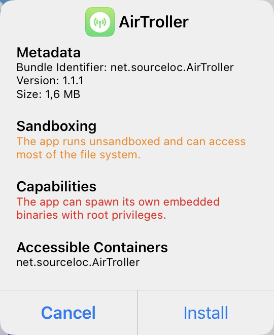
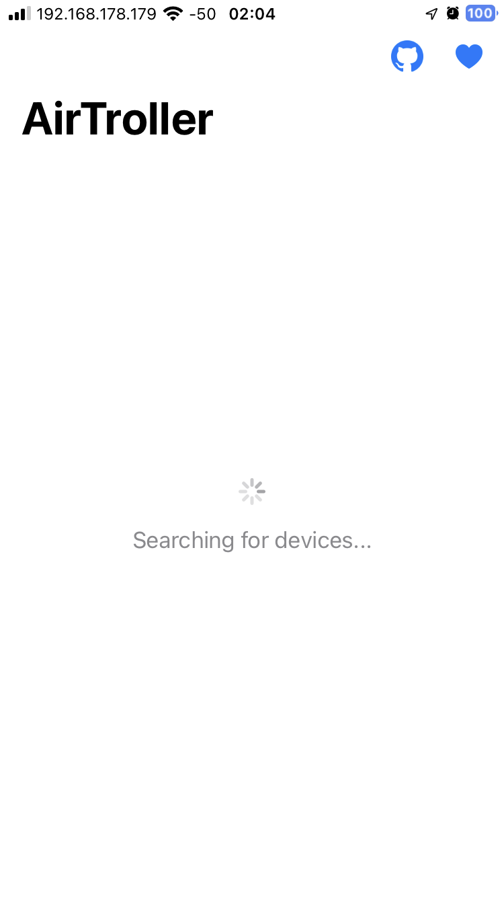

# Installing AirTroller

[AirTroller](https://github.com/sourcelocation/AirTroller) is an [TrollStore](https://github.com/opa334/TrollStore) app that allows you to spam people with AirDrop messages. In this guide, I will show you how to install AirTroller.

::: danger
AirTroller is for educational purposes only. Me or any of the involved developers are not responsible for any damage caused by this installation guide.
:::

## FAQ

**Q**: Is iOS version X supported? \
**A**: See the chart below.

**Q**: Can I install it on my Android phone? \
**A**: No, this is an iOS app. iOS works very differently from Android so it will not be possible to install TrollStore or AirTroller.

**Q**: Is my iDevice supported? \
**A**: If its running on a compatible iOS version, yes you can since TrollStore isn't limited to hardware.

**Q**: Is a jailbreak required? \
**A**: A: You **must have either** TrollStore or a Jailbreak to install and use the app.

## About TrollStore

TrollStore is an app that can be used to install `.ipa` files on iOS. See the chart below if your iDevice is compatible with TrollStore. This applies for AirTroller as well.

| iOS Version | Compatible? |
| :--- | :--- |
| 12.0 | ✅ Yes (requires [this](https://github.com/haxi0/AirTroller12) version of AirTroller) |
| 13.7 and <u>**below**</u> | ❌ No |YY
| 14.0 - 14.8.1 | ✅ Yes |
| 15.0 - 15.4.1 | ✅ Yes |
| 15.5 beta 1 - 4 | ✅ Yes |
| 15.5 (RC) | ❌ No |
| 15.6 beta 1 - 5 | ✅ Yes |
| 15.6 (RC1/2) and <u>**above**</u> | ❌ No |

::: tip
To check your iOS version, go to `Settings > General > About > Version`
:::

::: tip
**Get the latest version of TrollStore [here](https://github.com/opa334/TrollStore#installing-trollstore)**
:::

---

## Installing AirTroller

**1.** After installing TrollStore, we need to get the AirTroller `.ipa` file from GitHub. You can get the newest release [here](https://github.com/sourcelocation/AirTroller/releases/latest).

**2.** You should have gotten a file called `AirTroller-x.x.x.tipa`. 

**3.** Open TrollStore, click on the `+` button, and select the `.tipa` file. 

**4.** Click on `Install` and wait for the installation to finish.

---

## Finished!

Congrats, you now have AirTroller installed!

## Credits

- [opa334](https://github.com/opa334) for creating TrollStore
- [sourcelocation](https://github.com/sourcelocation) for creating AirTroller
- [matteodev8 (Schrank)](https://github.com/matteodev8) (aka me) for creating this guide
- [haxi0](https://github.com/haxi0/) for creating AirTroller12
- [Apple](https://www.apple.com) for creating iOS
- [GitHub](https://github.com) for hosting the source code of this guide
- [VuePress](https://vuepress.vuejs.org) for creating this site
